<p align="center">
  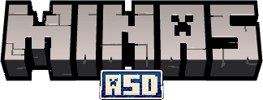
</p>

<h1 align="center">MinasASD</h1>

<p align="center">
  Advanced Prison Mines • Beacon Infrastructure • Discord Integration
</p>

<p align="center">
  
</p>

<p align="center">
  
  
  
  
</p>

---

<p align="center">
  
</p>

<p align="center">
  
</p>

MinasASD is a large-scale prison mining infrastructure plugin created for advanced Minecraft servers.

The plugin is divided into three major ecosystems:

- Advanced Mines
- Beacon Infrastructure
- Discord Synchronization

Rather than being a simple mine reset plugin, MinasASD was designed to create dynamic, interactive and progression-oriented mining experiences.

The system supports:
- Dynamic mines
- Non-cubic mine generation
- Custom drops
- Mine effects
- Holograms
- Beacon systems
- Anti-Xray
- Discord synchronization
- Custom blocks
- Advanced statistics
- Competitive gameplay support

---

# MINES

<p align="center">
  
</p>

<p align="center">
  
</p>

The mine command system is built around `/mina`, allowing administrators to manage every aspect of the mining ecosystem.

Core commands:
```txt
/mina crear
/mina editar
/mina eliminar
/mina reset
/mina effect
/mina holograma
/mina actionbar
/mina drops
/mina bloques
/mina antixray
```

<details>
<summary>View Detailed Command Information</summary>

<br>

The command structure was designed to centralize all mine management into a single workflow.

Possible administrative actions:
- Create mines
- Edit mines
- Configure mine regions
- Configure reset mechanics
- Configure effects
- Configure holograms
- Configure drops
- Configure actionbars
- Configure Anti-Xray
- Configure custom blocks
- Configure regeneration

The goal is to avoid fragmented configuration and provide a complete mine management ecosystem.

</details>

---

<p align="center">
  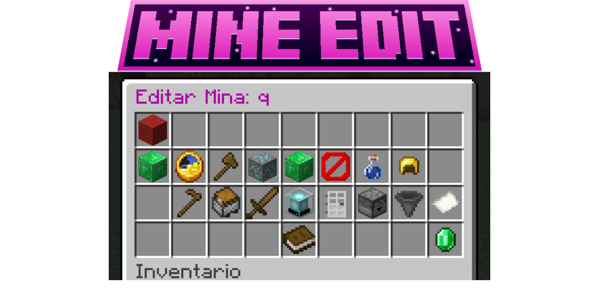
</p>

<p align="center">
  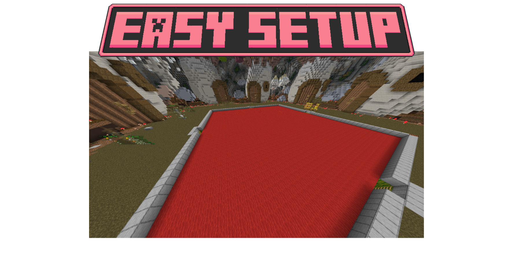
  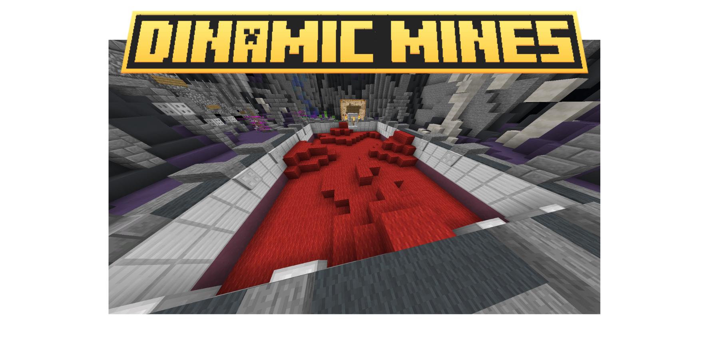
</p>

<p align="center">
  
</p>

MinasASD includes a complete mine editor accessible through:

```txt
/mina editar <mina>
```

This editor allows every mine to behave as its own independent gameplay environment.

Unlike traditional prison mine plugins that only support cube-shaped mines, MinasASD supports completely irregular mine shapes using wool-based region painting.

This allows:
- Curved mines
- Deformed mines
- Layered mines
- Organic mine layouts
- Adventure-style mines
- Cave-shaped mines

<details>
<summary>View Detailed Configuration Features</summary>

<br>

### Supported Mine Properties

- Mine name
- Display name
- Reset timers
- Mine regions
- Wool region painting
- Reset messages
- ActionBar messages
- Holograms
- Drops
- Effects
- Mine permissions
- Mine sounds
- Mine statistics
- Block pools
- Limited blocks
- Beacon compatibility

### Wool Painting System

The wool-based system allows administrators to manually paint the mine area instead of forcing standard cuboid shapes.

This creates:
- Dynamic terrain
- More immersive mines
- Natural-looking environments
- Custom pathways
- Unique layouts impossible in normal mine plugins

</details>

---

<p align="center">
  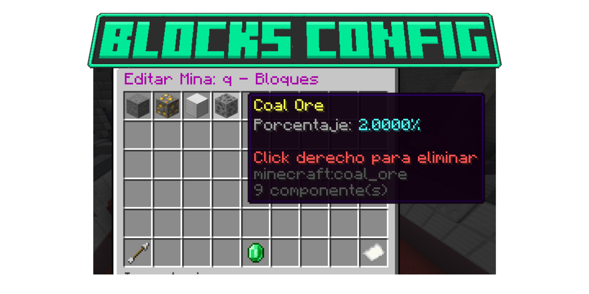
  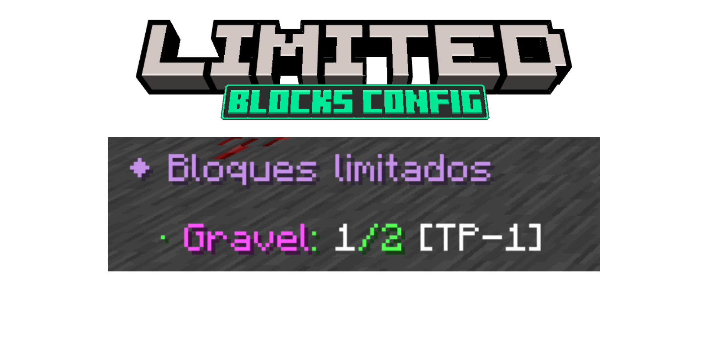
</p>

<p align="center">
  
</p>

MinasASD supports two different block systems:

- Normal blocks
- Limited blocks

Normal blocks behave as standard mine resources.

Limited blocks allow rare blocks to appear only under specific limits or probabilities, making progression and balancing much more interesting.

<details>
<summary>View Detailed Block Information</summary>

<br>

### Normal Blocks

Used for:
- Main mine resources
- Common materials
- Standard progression

### Limited Blocks

Used for:
- Rare ores
- Event resources
- Special progression
- Economy balancing
- Seasonal resources

Possible features:
- Chance-based spawning
- Limited quantity per reset
- Reset-based regeneration
- Rare drops
- Economy integration

This allows mines to feel dynamic rather than predictable.

</details>

---

<p align="center">
  
</p>

<p align="center">
  
</p>

MinasASD supports custom blocks from:
- ItemsAdder
- Oraxen
- Nexo

This allows servers to completely redesign their mine progression using fully custom resources.

Possible use cases:
- Custom crystals
- Magical ores
- Radiation blocks
- Event resources
- RPG progression items
- Custom economy materials

The plugin treats these blocks as native mine resources, allowing them to work with resets, drops, holograms and effects.

---

<p align="center">
  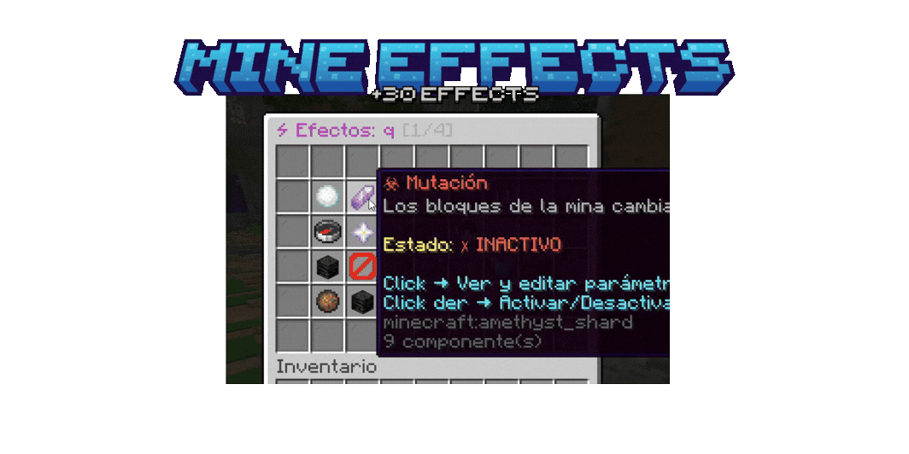
</p>

<p align="center">
  
</p>

<p align="center">
  
</p>

Each mine can contain its own independent effect system.

Effects can affect players while mining, entering regions or interacting with specific mine conditions.

This transforms mines into gameplay environments instead of simple block areas.

Features:
- Potion effects
- Visual effects
- Environmental effects
- Gameplay modifiers
- Region-linked effects
- Progression effects

<details>
<summary>View Detailed Effects Information</summary>

<br>

Possible effects:
- Speed boosts
- Mining fatigue
- Jump changes
- Visual ambience
- Radiation zones
- Darkness areas
- Magical mines
- Gravity modifiers
- Environmental particles
- Sound effects

The effect system can completely change how a mine feels and behaves.

This allows:
- Dangerous mines
- Magical mines
- Toxic mines
- Event mines
- Puzzle mines
- Atmospheric gameplay zones

</details>

---

<p align="center">
  
</p>

<p align="center">
  
</p>

MinasASD includes an advanced hologram system for mines.

Administrators can create multiple hologram divisions showing mine information, statistics and dynamic values.

Features:
- Multiple hologram lines
- RGB colors
- Dynamic placeholders
- Custom layouts
- Mine statistics
- Reset information

<details>
<summary>View Detailed Hologram Features</summary>

<br>

Supported information:
- Mine percentage
- Reset timers
- Blocks remaining
- Mine owner
- Statistics
- Leaderboards
- Dynamic placeholders

The system was designed to allow fully custom visual mine presentations.

</details>

---

<p align="center">
  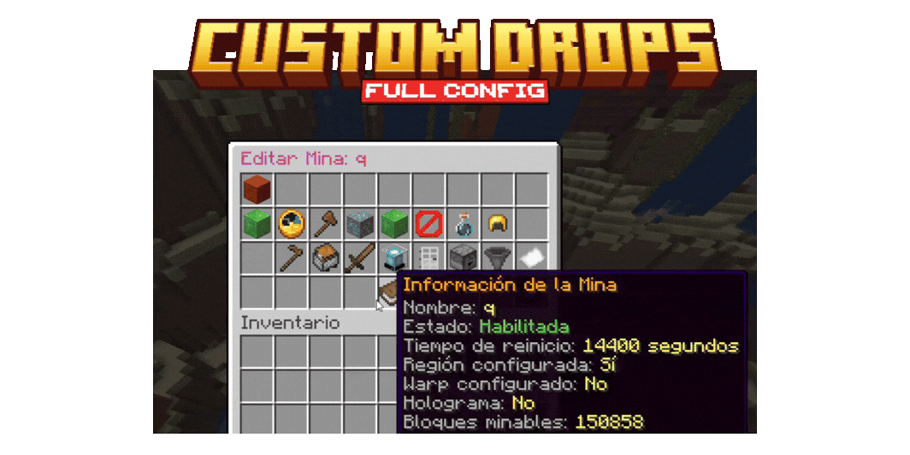
</p>

<p align="center">
  
</p>

<p align="center">
  
</p>

One of the most important systems inside MinasASD is the custom drop engine.

Every block inside a mine can generate completely independent rewards.

This means blocks are no longer restricted to dropping themselves.

Features:
- Custom item drops
- ItemStack support
- Custom probabilities
- Rare drops
- Multiple rewards
- Economy integration
- Plugin item support

<details>
<summary>View Detailed Drop Features</summary>

<br>

Possible drops:
- Vanilla items
- Custom items
- ItemsAdder items
- Oraxen items
- Nexo items
- Event items
- Economy rewards
- Tokens
- Keys
- Progression materials

Possible configurations:
- Drop chance
- Multiple rewards
- Randomized rewards
- Permission-based rewards
- Rare drops
- Visual effects
- Sounds
- Broadcast rewards

This system allows mines to become progression systems instead of simple resource generators.

</details>

---

<p align="center">
  
</p>

MinasASD supports:
- Automatic resets
- Chest systems
- Broadcast messages
- ActionBar systems
- Reset announcements
- Reset statistics

Commands:
```txt
/mina actionbar
```

Possible features:
- Percentage displays
- Dynamic reset timers
- Custom reset messages
- Mine completion broadcasts
- Automatic regeneration
- Rewarded resets

---

<p align="center">
  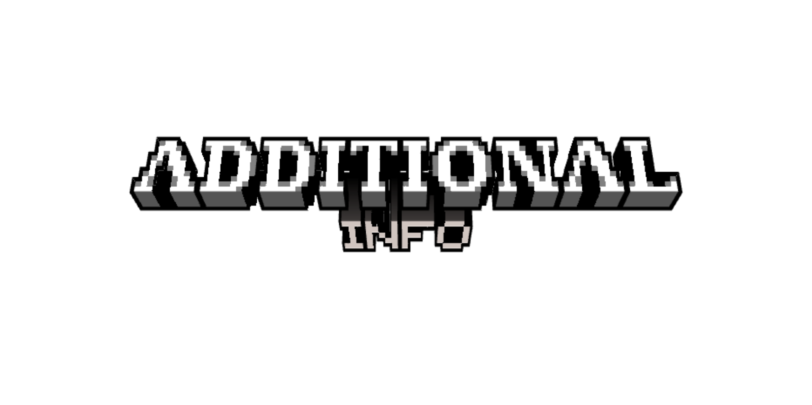
</p>

<p align="center">
  
</p>

Additional features:
- Custom display names
- Mine permissions
- RGB support
- Placeholder support
- Multi-world compatibility
- Sounds
- Broadcasts
- GUI systems
- Region linking

---

<p align="center">
  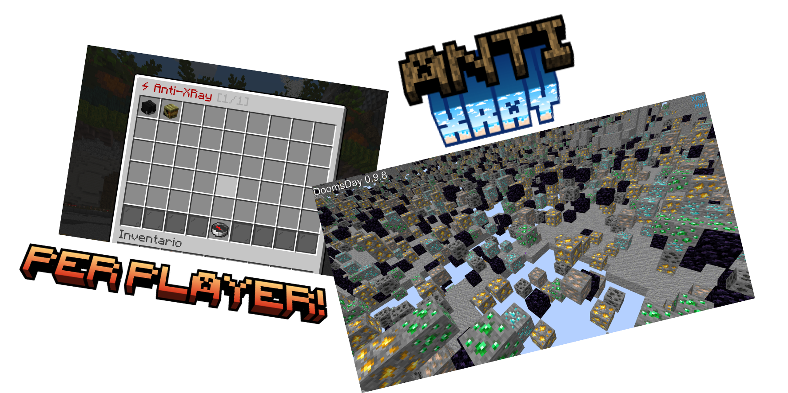
</p>

<p align="center">
  
</p>

MinasASD includes a built-in mine-focused Anti-Xray system.

Unlike global Anti-Xray solutions, this system affects only mines and can be enabled per player.

This makes it useful for:
- Staff inspections
- Moderation
- Cheat detection
- Mine protection

Features:
- Per-player Anti-Xray
- Mine-only behavior
- Staff inspection mode
- Visual obfuscation
- Mine-specific protection

---

# BEACONS

<p align="center">
  
</p>

<p align="center">
  
</p>

Beacon commands:
```txt
/beacon
/beacon add
/beacon quitar
/beacon booster
/beacon stats
```

The beacon system acts as a progression mechanic connected to mining.

---

<p align="center">
  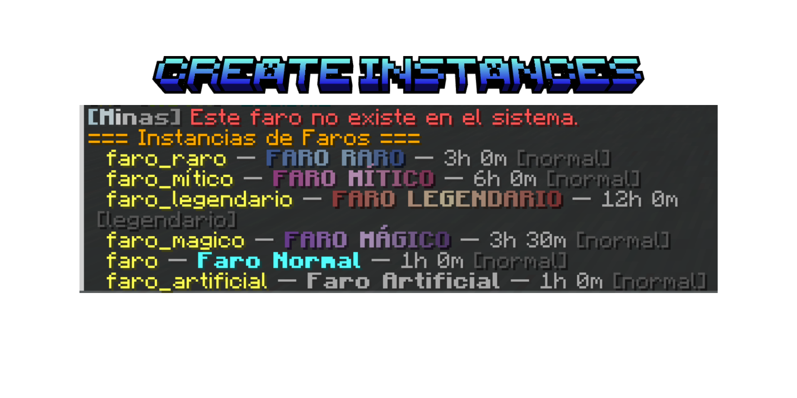
  
</p>

<p align="center">
  
</p>

Beacons work through independent instances.

Each beacon can:
- Store statistics
- Track blocks
- Apply effects
- Use boosters
- Link with players
- Handle progression

The system automatically places beacons in beacon-compatible locations.

---

<p align="center">
  
</p>

<p align="center">
  
</p>

Tracked statistics:
- Blocks mined
- Active time
- Beacon owner
- Progression
- Activity
- Effect usage

These statistics allow beacons to become progression tools rather than decorative blocks.

---

<p align="center">
  
</p>

<p align="center">
  
</p>

Beacons can apply:
- Custom effects
- Particles
- Mining bonuses
- Speed boosts
- Visual ambience
- Progression modifiers

The effect system was designed to make beacon placement strategic and rewarding.

---

<p align="center">
  
</p>

<p align="center">
  
</p>

Boosters allow players to extend beacon activity time.

Features:
- Booster items
- Booster commands
- Time extension
- Progression support
- Reward integration

Commands:
```txt
/beacon booster
```

---

<p align="center">
  
</p>

Additional beacon features:
- Automatic placement
- Beacon removal
- Permission systems
- Progression support
- Linked effects
- Beacon ownership

---

# DISCORD

<p align="center">
  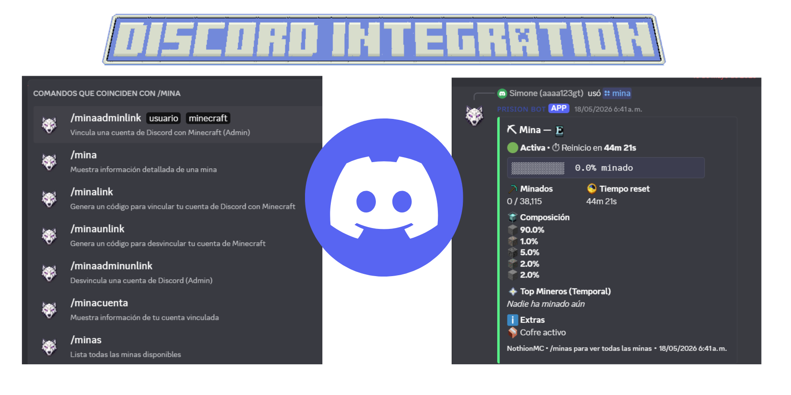
  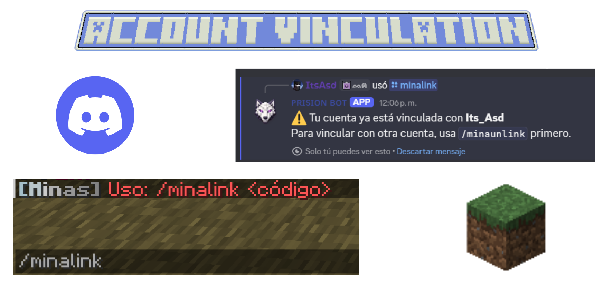
</p>

<p align="center">
  
</p>

MinasASD includes a Discord synchronization system.

This allows the plugin to communicate mine activity, statistics and player events directly to Discord.

Features:
- Embedded messages
- Account linking
- Event notifications
- Statistic synchronization
- Cross-platform interaction

Possible uses:
- Mine reset announcements
- Progression updates
- Reward notifications
- Beacon activity
- Staff moderation

---

<p align="center">
  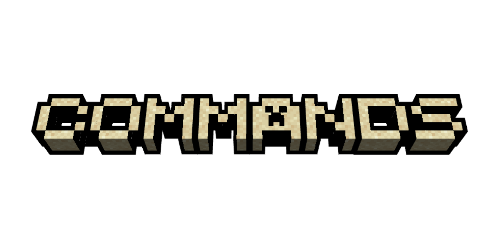
</p>

<p align="center">
  
</p>

```txt
/mina
/mina editar
/mina effect
/mina holograma
/mina actionbar
/mina drops
/mina antixray

/beacon
/beacon add
/beacon quitar
/beacon booster
/beacon stats
```

---

<p align="center">
  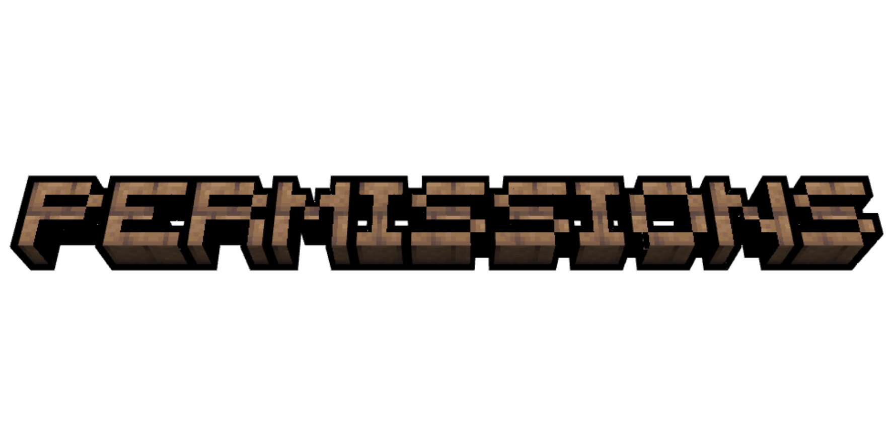
</p>

<p align="center">
  
</p>

```txt
minaasd.admin
minaasd.mina
minaasd.beacon
minaasd.antixray
minaasd.discord
```

---

<p align="center">
  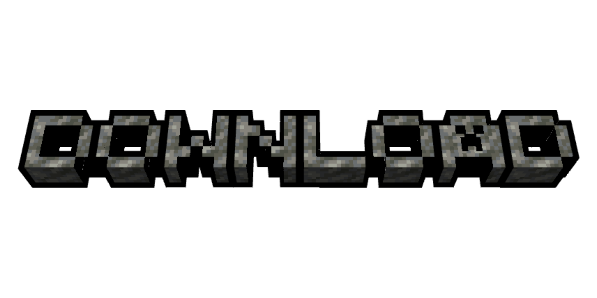
</p>

<p align="center">
  
</p>

MinasASD is distributed only as a compiled `.jar`.

The source code remains private because this plugin was developed exclusively for my own Minecraft infrastructure and gameplay ecosystem.

<p align="center">
  <a href="https://github.com/ItsAsddd/MinasASD/releases">
    
  </a>
</p>

---

```txt
Minecraft Version: 1.21.4
Server Software: Paper
Project Type: Personal / Private Infrastructure
Source Code: Private
Public Usage: Showcase only
```

<p align="center">
  
  
  
</p>